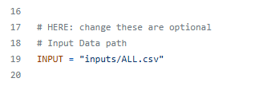
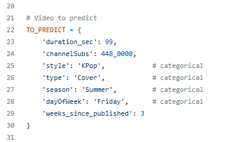
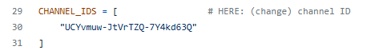
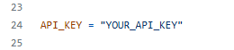

# YouTube-View-Count-Prediction-System

This project analyzes data from YouTube videos and implements a machine learning pipeline to predict the number of views a published video will receive based on various video data. 


## Table of Contents
1. [Navigation Guide](#1-navigation-guide)
2. [Installation](#install)
3. [Getting Started](#start)
4. [Pipeline Overview](#overview)
5. [Input Datas](#input)
    - [In inputs/ directory](#5a-in-inputs-directory)
    - [Data Schema](#5b-data-schema)
    - [YouTube API](#5c-youtube-api)
6. [Output Plots](#output)


<a name="navigation"></a>

## 1. Navigation Guide

```bash
repository
├── Documents/      ## Plots, Report
├── inputs/         ## input files
├── readme-imgs/    ## README figures
├── main.py             ## main script
├── view_distrib.py     ## generate distribution plot
```


<a name="install"></a>

## 2. Installation

### 2a) Main Script

This project requires using Python and the following Python libraries are used in _main.py_:
* pandas
* numpy
* scikit-learn
* scipy
* matplotlib
* seaborn

You can install the required libraries using the following command:
```bash
pip install pandas numpy scikit-learn scipy matplotlib seaborn
```

### 2b) Get Data

If you want to run _inputs/get*.py_, you will need these additional libaries:
* google-api-client
* isodate

And install using:
```bash
pip install google-api-python-client isodate
```


<a name="start"></a>

## 3. Getting Started

Follow the instructions to run the main script _main.py_:

#### 3.1. Clone and Navigate
```bash
# 1. Clone this repo to your local machine
git clone $THISREPO
# 2. Navigate into the repository directory
cd $THISREPO
```

#### 3.2. (optional) modify the code’s global variables
* **INPUT**: Path to the input file
* 
* **TO_PREDICT**: Information about the video to predict (For description on each column, see [4. Input Data](#input) section below for more detail.)
* 

#### 3.3. Run main.py
```bash
python3 main.py
```

#### 3.4. Look at Output
* terminal:
    * Model score
    * Top three important features
    * Predicted views for the video
* plots/ directory
    * see [5. Output Data](#output) section below for more detail


<a name="overview"></a>

## 4. Pipeline Overview

#### 4.1. Reads Input
* Take input csv file from the input/ directory and store as a Pandas DataFrame

#### 4.2. Data Processing
* Convert categorical colum to numerical values
* Drop unhelpful columns

#### 4.3. Machine Learning Mode
* Split data for testing and training
* Train the model of RandomForestRegressor
* Display model score
* Plot _performance.png_

#### 4.4. Feature Importance
* Extract importance from **model.feature_importances_**
* Plot _importance.png_
* Plot _correlation.png_

#### 4.5. (optional) Comfirm Correlation
* To see the _subs.png_ correlaiton plot for comfirming that, subscriber count affects views, in **main()**, uncomment:
```bash
#plot_subs(df)
```

#### 4.6. Predicting
* Predict the view of the **TO_PREDICT** video using the trained model


<a name="input"></a>

## 5. Input Datas

### 5a) In inputs/ directory:
```bash
repository
├── inputs/
    ├── 1_ChannelID_lists/
    ├── 2_Individuals/
        ├── combine.py
    ├── 3_Combined/
        ├── */
    ├── ALL.csv             ## a full ready-to-run data
    ├── check.py
    ├── get*.py
```

> _ChannelID_list/_:
> * Stores differnt csv files
> * Each contains 'channel', 'ID' if you want to play around with creating data files yourself
> 
> _2_Individuals/_:
> * Stores different csv files
> * Each file is the music video data for a channel
> 
> _combine.py_:
> * To combine csv files in current directory into one csv file
> 
> _3_Combined/_:
> * Stores different csv files
> * Files are created by applying _combine.py_ on each _2_Individuals/*/_
> 
> _check.py_:
> * To check whether the csv file in current directory contains any missing value
> 
> _get*.py/_:
> * For getting data file
> * Different files because each types of singer have slightly different patten of extracting video (Modify when needed)
> * You WILL NEED to have a [YouTube API KEY](#api)
> * Change the **CHANNEL_IDS** for getting different channel
> * 


### 5b) Data Schema:
```
['style', 'channelId', 'channelSubs', 'title', 'type', 'duration_sec', 'publishedAt', 'dayOfWeek', 'season', 'views', 'likes', 'comments', 'engagment']
```

> **'style'**:
> * The music style of the singer
> * '**EN**', '**KPop**', '**KPop**', '**TW**', '**vTubers**'
> 
> **'type'**
> * The type of the music video
>   * '**Dance**': Any Dance, Choreography version of music video
>   * '**Remix**': Any Remix of existing music video
>   * '**LangVer**': Any different-language version of music video
>   * '**Live**': Any live version of music video 
>   * '**Cover**': Any song cover (not live)
>   * '**Lyric**': Any video title contain 'lyric' explicitly
>   * '**Audio**': Any song video with no visualization
>   * '**MV**': Any original music video not categorized to above types
> 
> **'dayOfWeek'**
> * The day of week of the publish date
> * '**Monday**', '**Tuesday**', '**Wednesday**', '**Thursday**', '**Friday**', '**Saturday**', '**Sunday**'
> 
> **'season'**
> * The season of the publish date
>   * '**Winter**': months in December, January, Feburary
>   * '**Spring**': months in March, April, May
>   * '**Summer**': months in June, July, August
>   * '**Fall**': months in September, October, November
>
> **'engagment'**
> * The (likes + comments) / views
> * We drop this later because it's not our main focus
>
> The other ones are extracted from [YouTube API](#api)


### 5c) YouTube API:

For getting video data using YouTube API and _inputs/get*.py_, you will need **TouTube API key**

If you don't have a API Key yet:

[Tutorial from Corey Schafer](https://youtu.be/th5_9woFJmk?si=nXYUl09lwzNAxQ2J):
1. Go to the [Google Cloud Console](https://cloud.google.com/cloud-console?utm_source=google&utm_medium=cpc&utm_campaign=na-CA-all-en-dr-bkws-all-all-trial-e-dr-1710134&utm_content=text-ad-none-any-DEV_c-CRE_727566101993-ADGP_Hybrid+%7C+BKWS+-+MIX+%7C+Txt-Management+Tools-Cloud+Console-KWID_43700077225651384-kwd-55675752867&utm_term=KW_google%20cloud%20console-ST_google+cloud+console&gclsrc=aw.ds&gad_source=1&gad_campaignid=20363681748&gclid=Cj0KCQjwqebEBhD9ARIsAFZMbfzEpEz8eTMppF12i-lk9b-7pC021VOB1wcKvoBhqd3axuRahvCQ49QaAk2CEALw_wcB)
2. Click "Create Project" and give it a name
3. Go to APIs & Services > Library
    * Search "YouTube Data API v3"
    * Click into it, then click "Enable"
4. Go to APIs & Services > Credentials
    * Click "+ Create Credentials" > API key

Once you have your API Key. 
* You will need to put this key into _get/*.py_
* replace the global variable: **API_KEY** with your key
* 


<a name="output"></a>

## 6. Output Plots

### In plots/ directory:
```bash
repository
├── plots/
    ├── performance.png
    ├── importance.png
    ├── correlation.png
    ├── subs.png
```

> _performance.png_:
> * Actual vs. Predicted Views for sample indices in the existing data
> 
> _importance.png_:
> * Bar plot showing each feature’s importance value
> 
> _correlation.png_:
> * Correlation between the top three important features and views
> 
> _subs.png_:
> * Scatter plot showing the relationship between channel subscriber count and the average views for each channel’s different video types


